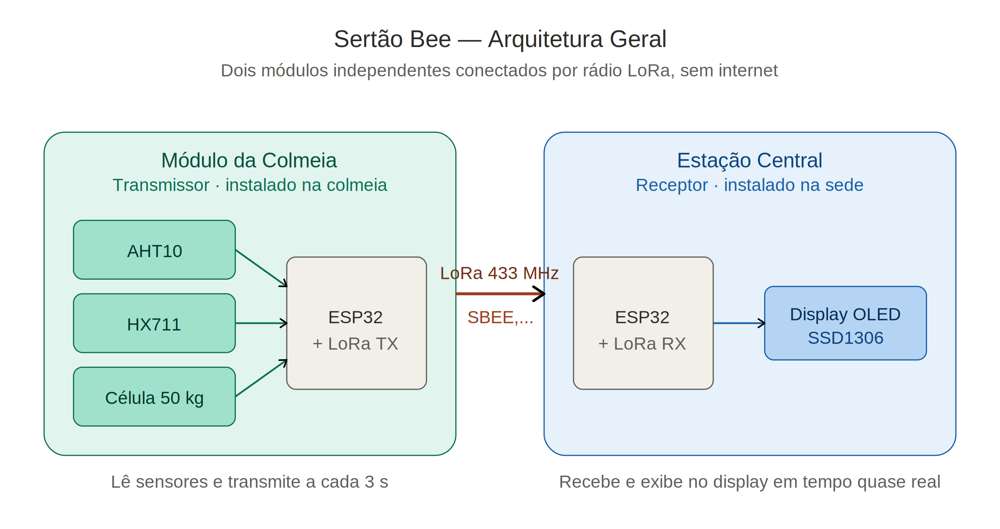

# Arquitetura — Sertão Bee

Este documento descreve a arquitetura técnica do sistema **Sertão Bee**, suas escolhas de projeto e o caminho dos dados, da colmeia até o display que o apicultor consulta.

---

## 1. Visão Geral

O sistema é composto por **dois módulos independentes** que se comunicam por **rádio LoRa (433 MHz) ponto a ponto**, sem necessidade de Wi-Fi, internet, gateway LoRaWAN ou qualquer operadora.



> Os diagramas detalhados de ligação pino a pino dos dois módulos estão em [`ligacoes.md`](ligacoes.md).

---

## 2. Decisões de Projeto

### 2.1 Por que LoRa, e não Wi-Fi/4G?

| Critério | Wi-Fi / 4G | LoRa 433 MHz |
|---|---|---|
| Cobertura em zona rural | Baixa / ausente | Centenas de metros a quilômetros |
| Consumo de energia | Alto | Baixo |
| Custo de operação | Plano de dados / infraestrutura | Zero após instalação |
| Dependência de terceiros | Operadora / provedor | Nenhuma |

A escolha do **LoRa em modo ponto a ponto** (não LoRaWAN) é deliberada: elimina a necessidade de gateway, servidor de rede e qualquer infraestrutura externa. O módulo da colmeia fala diretamente com a estação central.

A frequência **433 MHz** foi escolhida por ser de uso permitido no Brasil para aplicações de baixa potência e por oferecer boa penetração em ambiente rural.

### 2.2 Por que ESP32?

- Custo acessível, fácil aquisição no mercado brasileiro
- Núcleo de processamento suficiente para o trabalho exigido
- Bibliotecas maduras para LoRa, I²C e HX711
- Permite expansão futura (Wi-Fi local para painel web, BLE, microSD)

### 2.3 Por que AHT10?

Temperatura e umidade são as duas grandezas ambientais mais relevantes para o manejo apícola (controle de enxameação, perda d'água do mel, estresse térmico). O AHT10 entrega ambas em um único componente I²C, com precisão adequada e custo baixo.

### 2.4 Por que HX711 + célula de carga 50 kg?

O peso da colmeia é o indicador mais direto de produção de mel e de saúde da colônia. A célula de 50 kg cobre a faixa típica de uma colmeia produtiva (15–40 kg em produção). O HX711 é o conversor A/D de 24 bits clássico para esta aplicação — barato, confiável e bem documentado.

### 2.5 Por que OLED, e não LCD ou Wi-Fi local?

O display OLED SSD1306 0,96" foi escolhido por:
- Boa legibilidade em ambiente externo coberto
- Baixíssimo consumo
- Interface I²C simples
- Suficiente para a quantidade de informação exibida (5 linhas)

Wi-Fi local com painel web está previsto na **Fase 3 do roadmap**, sem substituir o display — o objetivo é manter a operação básica acessível sem smartphone.

---

## 3. Fluxo de Dados

### 3.1 Sentido único — colmeia → estação

A comunicação é **unidirecional** no MVP. O módulo da colmeia transmite ciclicamente e a estação central apenas escuta. Não há ACK, não há retransmissão. Esta simplicidade é proposital para o MVP — elimina toda a complexidade de protocolo bidirecional sem prejuízo do uso prático (perder pacotes ocasionais não afeta a tomada de decisão do apicultor).

### 3.2 Ciclo do transmissor (módulo da colmeia)

```
1.  Inicialização: I²C, AHT10, HX711, LoRa
2.  Loop a cada ~3 segundos:
       a. Lê temperatura e umidade do AHT10
       b. Lê peso do HX711 (média de 5 amostras)
       c. Monta string no formato SBEE,...
       d. Envia pacote LoRa
       e. Imprime no Serial (depuração)
       f. Aguarda 3 s
```

### 3.3 Ciclo do receptor (estação central)

```
1.  Inicialização: I²C, OLED, LoRa
2.  Exibe tela inicial "Aguardando dados"
3.  Loop contínuo:
       a. LoRa.parsePacket() — verifica se chegou algo
       b. Se chegou:
            - Lê o pacote inteiro
            - Confere se começa com "SBEE"
            - Extrai os campos por vírgula
            - Lê RSSI (força do sinal)
            - Atualiza o OLED
            - Imprime no Serial
       c. Caso contrário, segue escutando
```

### 3.4 Formato do pacote

```
SBEE,<id>,<temp_C>,<umid_%>,<peso_kg>,<contador>
```

- **`SBEE`** — identificador fixo do protocolo. A estação central ignora qualquer pacote LoRa que não comece com isso (proteção mínima contra ruído / outros transmissores na faixa).
- **`<id>`** — identificador da colmeia (inteiro). Permite múltiplas colmeias no futuro.
- **`<temp_C>`** — temperatura em °C, 1 casa decimal.
- **`<umid_%>`** — umidade relativa em %, 1 casa decimal.
- **`<peso_kg>`** — peso em kg, 2 casas decimais.
- **`<contador>`** — contador incremental de pacotes desde o boot. Permite estimar perda de pacotes na estação central.

**Exemplo real:** `SBEE,1,32.4,58.2,18.75,142`

### 3.5 Parâmetros do enlace LoRa

| Parâmetro | Valor | Onde é definido |
|---|---|---|
| Frequência | 433 MHz | `FREQUENCIA_LORA` |
| Sync Word | `0xF3` | `LoRa.setSyncWord()` |
| CRC | Habilitado | `LoRa.enableCrc()` |
| Spreading Factor | Padrão da biblioteca (SF7) | — |
| Bandwidth | Padrão da biblioteca (125 kHz) | — |
| Coding Rate | Padrão da biblioteca (4/5) | — |

O **Sync Word** é o filtro primário do enlace. Os dois módulos precisam usar o mesmo valor (`0xF3`) para se comunicarem.

---

## 4. Tela do OLED

A estação central exibe cinco linhas:

```
SERTAO BEE  ID:1
Temp: 32.4 C
Umid: 58.2 %
Peso: 18.75 kg
RSSI:-67  Pct:142
```

- **Linha 1:** identificação do produto e da colmeia.
- **Linhas 2–4:** as três grandezas monitoradas.
- **Linha 5:** RSSI (intensidade do último pacote recebido, em dBm) e contador de pacotes. Esses dois valores juntos permitem ao usuário avançado avaliar a qualidade do enlace.

Antes do primeiro pacote, o display mostra `"SERTAO BEE — Estacao Central — Aguardando dados"`.

---

## 5. Arquitetura Física


A eletrônica fica **fora da colmeia**, em caixa de proteção lateral, para:
- Manter as abelhas afastadas dos circuitos
- Permitir manutenção sem abrir a colmeia
- Evitar propólis nos componentes

Apenas o sensor AHT10 e a célula de carga ficam expostos ao ambiente interno e à base da colmeia, respectivamente.

---

## 6. Limitações conhecidas do MVP

- **Sem retransmissão / ACK.** Pacotes perdidos não são recuperados. Mitigação: ciclo curto (3 s) garante atualização frequente.
- **Sem armazenamento histórico.** O OLED mostra apenas a leitura mais recente. Histórico está previsto na Fase 3 (microSD).
- **Sem alimentação solar.** O MVP usa USB. Painel solar + bateria entram na Fase 3.
- **Apenas uma colmeia por estação central.** O campo `ID` no protocolo já prepara para múltiplas, mas a estação central atual sobrescreve a leitura a cada pacote, independentemente do ID.

Essas limitações são intencionais — o MVP foca em validar o enlace LoRa e a coleta dos três parâmetros principais.

---

## 7. Próximos passos arquiteturais (roadmap)

| Fase | Mudança arquitetural |
|---|---|
| 2 — Campo | Calibração em campo real, ajuste de interface |
| 3 — Expansão | Painel web local via Wi-Fi do ESP32, armazenamento em microSD, alimentação solar com bateria, suporte a múltiplas colmeias com identificação por ID |
