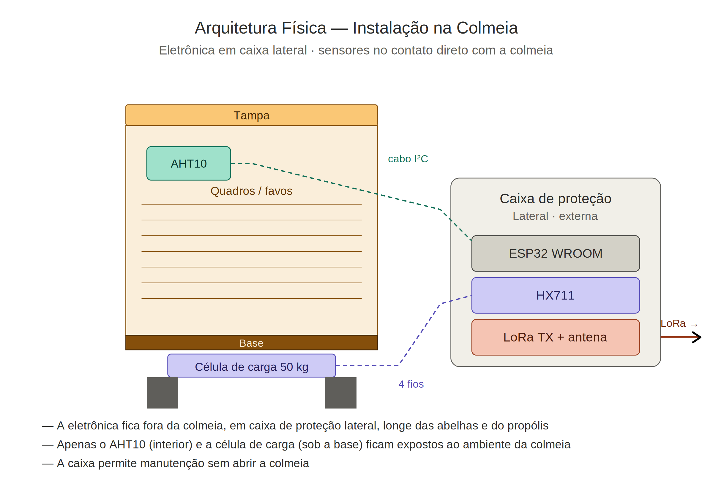

# Arquitetura — Sertão Bee

Este documento descreve a arquitetura técnica do sistema **Sertão Bee**, suas escolhas de projeto e o caminho dos dados, da colmeia até o display que o apicultor consulta.

---

## 1. Visão Geral

O sistema é composto por **dois módulos independentes** que se comunicam por **rádio LoRa (433 MHz) ponto a ponto**. O enlace entre a colmeia e a estação **não usa Wi-Fi, internet, gateway LoRaWAN nem operadora** — é rádio puro. (O Wi-Fi aparece apenas dentro da estação central, como rede local para o painel no celular; ver seção 4.2.)


> Os diagramas detalhados de ligação pino a pino dos dois módulos estão em [`ligacoes.md`](ligacoes.md).

---

## 2. Decisões de Projeto

### 2.1 Por que LoRa, e não Wi-Fi/4G?

| Critério | Wi-Fi / 4G | LoRa 433 MHz |
|---|---|---|
| Cobertura em zona rural | Baixa / ausente | Centenas de metros a quilômetros |
| Consumo de energia | Alto | Baixo |
| Custo de operação | Plano de dados / infraestrutura | Zero após instalação |
| Dependência de terceiros | Operadora / provedor | Nenhuma |

A escolha do **LoRa em modo ponto a ponto** (não LoRaWAN) é deliberada: elimina a necessidade de gateway, servidor de rede e qualquer infraestrutura externa. O módulo da colmeia fala diretamente com a estação central.

A frequência **433 MHz** foi escolhida por ser de uso permitido no Brasil para aplicações de baixa potência e por oferecer boa penetração em ambiente rural.

> **Atenção a uma distinção importante:** o LoRa é usado para o **enlace entre a colmeia e a estação** (a longa distância, onde não há internet). Já o **Wi-Fi do ESP32** é usado de outra forma — apenas como **rede local na própria estação central**, para o apicultor abrir o painel no celular dentro da propriedade. Em nenhum momento o sistema depende de internet ou de cobertura de operadora.

### 2.2 Por que ESP32?

- Custo acessível, fácil aquisição no mercado brasileiro
- Núcleo de processamento suficiente para o trabalho exigido
- Bibliotecas maduras para LoRa, I²C e HX711
- Permite o **painel web local via Wi-Fi** já no MVP, e expansões futuras (BLE, microSD) sem trocar de placa

### 2.3 Por que AHT10?

Temperatura e umidade são as duas grandezas ambientais mais relevantes para o manejo apícola (controle de enxameação, perda d'água do mel, estresse térmico). O AHT10 entrega ambas em um único componente I²C, com precisão adequada e custo baixo.

### 2.4 Por que HX711 + célula de carga 50 kg?

O peso da colmeia é o indicador mais direto de produção de mel e de saúde da colônia. A célula de 50 kg cobre a faixa típica de uma colmeia produtiva (15–40 kg em produção). O HX711 é o conversor A/D de 24 bits clássico para esta aplicação — barato, confiável e bem documentado.

### 2.5 Por que OLED *e* painel web local?

A estação central oferece **duas formas de visualização que funcionam ao mesmo tempo**:

O **display OLED SSD1306 0,96"** foi escolhido por sua boa legibilidade em ambiente externo coberto, baixíssimo consumo, interface I²C simples e por ser suficiente para a informação exibida (5 linhas). Ele garante a leitura básica **sem precisar de celular**.

O **painel web local** complementa o OLED: o ESP32 cria uma rede Wi-Fi própria (modo Access Point, chamada `SertaoBee`) e serve uma página em `http://192.168.4.1`, com cards grandes que atualizam sozinhos a cada 2 segundos. É mais confortável de ler num celular e prepara o terreno para histórico e múltiplas colmeias.

> **Sem contradição com o "offline":** o painel web **não usa internet**. O Wi-Fi é uma rede local gerada pelo próprio ESP32 — sem roteador, sem operadora, sem nuvem. O enlace colmeia→estação continua sendo rádio LoRa puro. Os dois módulos seguem operando em qualquer apiário sem sinal de celular.

---

## 3. Fluxo de Dados

### 3.1 Sentido único — colmeia → estação

A comunicação é **unidirecional** no MVP. O módulo da colmeia transmite ciclicamente e a estação central apenas escuta. Não há ACK, não há retransmissão. Esta simplicidade é proposital para o MVP — elimina toda a complexidade de protocolo bidirecional sem prejuízo do uso prático (perder pacotes ocasionais não afeta a tomada de decisão do apicultor).

### 3.2 Ciclo do transmissor (módulo da colmeia)

```
1.  Inicialização: I²C, AHT10, HX711, LoRa
2.  Loop a cada ~3 segundos:
       a. Lê temperatura e umidade do AHT10
       b. Lê peso do HX711 (média de 5 amostras)
       c. Monta string no formato SBEE,...
       d. Envia pacote LoRa
       e. Imprime no Serial (depuração)
       f. Aguarda 3 s
```

### 3.3 Ciclo do receptor (estação central)

```
1.  Inicialização: I²C/OLED, Wi-Fi local (Access Point), servidor web, LoRa
2.  Exibe no OLED a rede e o endereço (SertaoBee / 192.168.4.1)
3.  Loop contínuo:
       a. server.handleClient() — atende quem abriu o painel web
       b. LoRa.parsePacket() — verifica se chegou pacote LoRa
       c. Se chegou:
            - Lê o pacote inteiro
            - Lê RSSI (força do sinal) e guarda o pacote bruto
            - Confere se começa com "SBEE"
            - Extrai os campos por vírgula
            - Atualiza o OLED e os dados servidos no painel web
            - Imprime no Serial
       d. Caso contrário, segue atendendo o web e escutando o LoRa
```

O painel web é servido por dois endpoints: `/` devolve a página HTML, e `/dados` devolve um JSON com as últimas leituras. O navegador do apicultor chama `/dados` a cada 2 segundos (via `fetch`) e atualiza os cards na tela sem recarregar a página.

### 3.4 Formato do pacote

```
SBEE,<id>,<temp_C>,<umid_%>,<peso_kg>,<contador>
```

- **`SBEE`** — identificador fixo do protocolo. A estação central ignora qualquer pacote LoRa que não comece com isso (proteção mínima contra ruído / outros transmissores na faixa).
- **`<id>`** — identificador da colmeia (inteiro). Permite múltiplas colmeias no futuro.
- **`<temp_C>`** — temperatura em °C, 1 casa decimal.
- **`<umid_%>`** — umidade relativa em %, 1 casa decimal.
- **`<peso_kg>`** — peso em kg, 2 casas decimais.
- **`<contador>`** — contador incremental de pacotes desde o boot. Permite estimar perda de pacotes na estação central.

**Exemplo real:** `SBEE,1,32.4,58.2,18.75,142`

### 3.5 Parâmetros do enlace LoRa

| Parâmetro | Valor | Onde é definido |
|---|---|---|
| Frequência | 433 MHz | `FREQUENCIA_LORA` |
| Sync Word | `0xF3` | `LoRa.setSyncWord()` |
| CRC | Habilitado | `LoRa.enableCrc()` |
| Spreading Factor | Padrão da biblioteca (SF7) | — |
| Bandwidth | Padrão da biblioteca (125 kHz) | — |
| Coding Rate | Padrão da biblioteca (4/5) | — |

O **Sync Word** é o filtro primário do enlace. Os dois módulos precisam usar o mesmo valor (`0xF3`) para se comunicarem.

---

## 4. Interfaces de visualização

A estação central mostra os mesmos dados em dois lugares ao mesmo tempo: no display OLED e no painel web local.

### 4.1 Tela do OLED

A estação central exibe cinco linhas:

```
SERTAO BEE  ID:1
Temp: 32.4 C
Umid: 58.2 %
Peso: 18.75 kg
RSSI:-67  P:142
```

- **Linha 1:** identificação do produto e da colmeia.
- **Linhas 2–4:** as três grandezas monitoradas.
- **Linha 5:** RSSI (intensidade do último pacote recebido, em dBm) e contador de pacotes. Esses dois valores juntos permitem avaliar a qualidade do enlace.

Na inicialização, o OLED mostra a rede Wi-Fi e o endereço de acesso (`SertaoBee` / `192.168.4.1`). Após o primeiro pacote válido, passa a exibir as cinco linhas acima.

### 4.2 Painel web local

O ESP32 da estação central cria uma rede Wi-Fi própria e serve uma página responsiva, pensada para o celular do apicultor:

- **Rede:** `SertaoBee` · **Senha:** `12345678` · **Endereço:** `http://192.168.4.1`
- **O que mostra:** cards de colmeia (ID), temperatura, umidade, peso, sinal LoRa (RSSI) e contador de pacotes, além do último pacote bruto recebido e um indicador de status.
- **Como atualiza:** o navegador chama o endpoint `/dados` (JSON) a cada 2 segundos e atualiza os valores sem recarregar a página.
- **Offline:** é uma rede local do próprio dispositivo (Access Point), sem internet, sem roteador e sem nuvem.

| Endpoint | Método | Devolve |
|---|---|---|
| `/` | GET | Página HTML do painel |
| `/dados` | GET | JSON com as últimas leituras e o status de recepção |

---

## 5. Arquitetura Física



A eletrônica fica **fora da colmeia**, em caixa de proteção lateral, para:
- Manter as abelhas afastadas dos circuitos
- Permitir manutenção sem abrir a colmeia
- Evitar propólis nos componentes

Apenas o sensor AHT10 e a célula de carga ficam expostos ao ambiente interno e à base da colmeia, respectivamente.

---

## 6. Limitações conhecidas do MVP

- **Sem retransmissão / ACK.** Pacotes perdidos não são recuperados. Mitigação: ciclo curto (3 s) garante atualização frequente.
- **Sem armazenamento histórico.** OLED e painel web mostram apenas a leitura mais recente. Histórico está previsto na Fase 3 (microSD).
- **Sem alimentação solar.** O MVP usa USB. Painel solar + bateria entram na Fase 3.
- **Apenas uma colmeia por estação central.** O campo `ID` no protocolo já prepara para múltiplas, mas a estação central atual sobrescreve a leitura a cada pacote, independentemente do ID.
- **Painel web mostra uma colmeia por vez.** A estrutura de dados servida no JSON guarda a última leitura recebida; o suporte a várias colmeias simultâneas no painel é evolução prevista.

Essas limitações são intencionais — o MVP foca em validar o enlace LoRa, a coleta dos três parâmetros principais e a visualização (OLED + painel web local).

---

## 7. Próximos passos arquiteturais (roadmap)

| Fase | Status | Mudança arquitetural |
|---|---|---|
| 1 — MVP | ✅ feito | Enlace LoRa, leitura dos 3 parâmetros, OLED **e painel web local via Wi-Fi do ESP32** |
| 2 — Campo | a fazer | Calibração em campo real, testes de alcance, ajuste de interface |
| 3 — Expansão | a fazer | Armazenamento histórico em microSD, alimentação solar com bateria, alertas, suporte a múltiplas colmeias por ID (no OLED e no painel) |